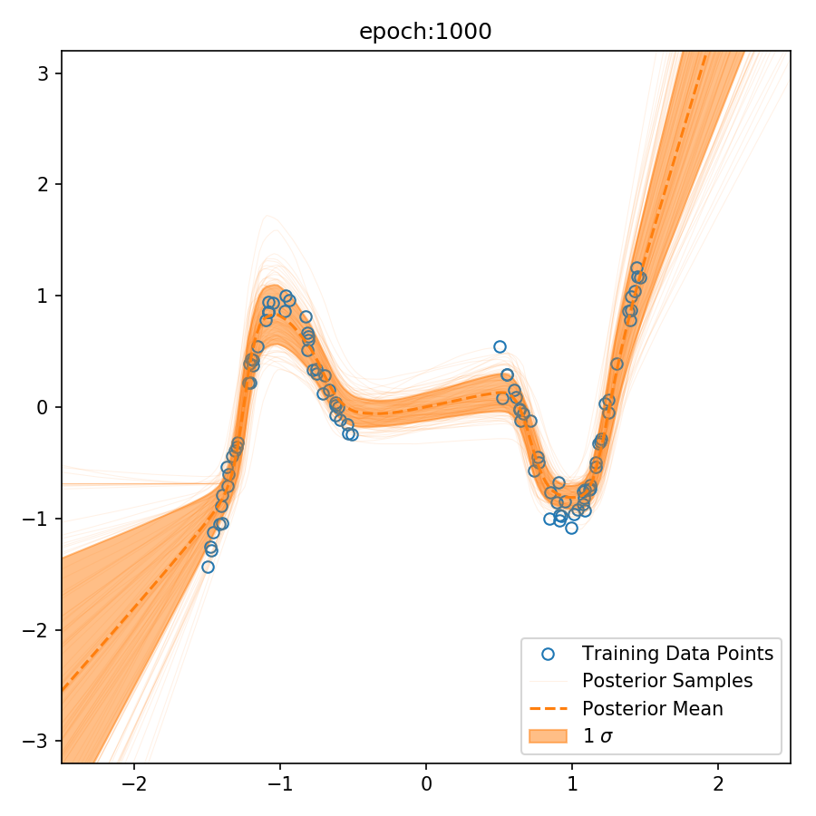

# Bayesian Neural Network

ニューラルネットの重みをベイズ推定しましょう

論文の内容および実験結果については [ニューラルネットへのベイズ推定 - Bayesian Neural Network](http://nykergoto.hatenablog.jp/entry/2017/08/14/%E3%83%8B%E3%83%A5%E3%83%BC%E3%83%A9%E3%83%AB%E3%83%8D%E3%83%83%E3%83%88%E3%81%B8%E3%81%AE%E3%83%99%E3%82%A4%E3%82%BA%E6%8E%A8%E5%AE%9A_-_Baysian_Neural_Network) にて解説しています

## 概要

ニューラルネットワークの過学習防止としてもちいられる Dropout という枠組みがあります。これがネットワークの重みに対してベイズ推定を行っていることに相当するということが [Uncertainty in Deep Learning](http://mlg.eng.cam.ac.uk/yarin/thesis/thesis.pdf) にて主張されています。

本リポジトリはこの論文を元にデータセットや活性化関数、dropout の種類などを変えた時に重みの事後分布による予測がどのように分布するか、を可視化することを目的としています。

## Requirements

BNN モジュールの実行に必要なパッケージは以下のとおりです.

```text
chainer==1.24.0
numpy
matplotlib
scikit-learn
pandas
```

## Quick Start

### With Docker (Recommended)

docker + docker-compose で実行するのがもっとも手軽です。実行のためにホストマシン上に docker 及び docker-compose をインストールしておいてください。
インストール後に以下のコマンドを実行すると [localhost:7010](http://localhost:7010) に jupyter notebook が起動します

```bash
cp project.env .env
docker-compose build
docker-compose up -d
```

`docker-compose ps` を実行してちゃんと jupyter が起動しているか確認します.(State が Up になっていれば OK です) 以下の例であれば localhost:7010 に jupyter が起動しています.

```bash
➜ docker-compose ps
    Name                   Command               State           Ports
-------------------------------------------------------------------------------
bayse-jupyter   /usr/bin/tini -- jupyter n ...   Up      0.0.0.0:7010->8888/tcp
```

> [http://localhost:7010/notebooks/notebooks/simple_sample.ipynb](http://localhost:7010/notebooks/notebooks/simple_sample.ipynb) にサンプルコードがありますので参考にしてください

## Usage

```python
from bnn import BNNEstimator
from bnn import article_data

clf = BNNEstimator()

x_train, y_train, _ = article_data.make_data(size=100, function_type="art1")

# data_name は出力先のフォルダを作成するのに必要
clf.fit(x_train, y_train, data_name="art1")
```

## Run with sample setting

```bash
python main.py -h

optional arguments:
  -h, --help            show this help message and exit
  -e E                  number of epochs.
  -m MASK, --mask MASK  type of mask function. dropout, gaussian, none.
  -a ACTIVATE, --activate ACTIVATE
                        type of activate function.
  -d DATA, --data DATA
  --hidden HIDDEN       number of hidden dimensions.
```

## Example

> NOTE: docker で動かしている場合には container 内部でコマンドを実行する必要があります。
> `docker exec -it bayse-jupyter bash` でコンテナに潜り込んだ後に実行してください。

```bash
python main.py
```

* hidden layer dim: 512
* activation: relu
* mask function: dropout
* optimizer: Adam (weight decay 4 * 10^-5)


活性化関数を `sigmoid` に変更

```bash
python main.py -a sigmoid
```


隠れ層の次元を 512 -> 32 に変更

```bash
python main.py --hidden 32
```


データセットを変更

```bash
python main.py --data art2
```


