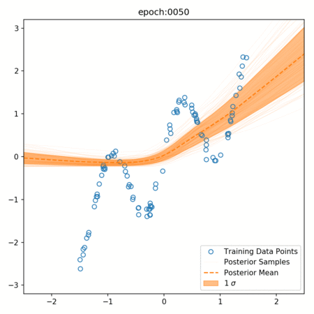
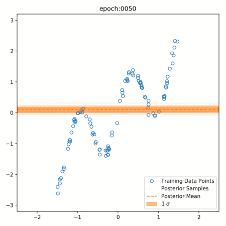
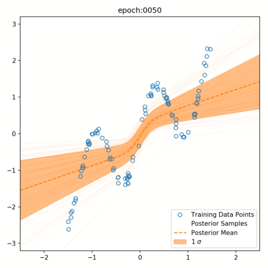

# Bayesian Neural Network

ニューラルネットの重みをベイズ推定しましょう

論文の内容および実験結果については [ニューラルネットへのベイズ推定 - Bayesian Neural Network](http://nykergoto.hatenablog.jp/entry/2017/08/14/%E3%83%8B%E3%83%A5%E3%83%BC%E3%83%A9%E3%83%AB%E3%83%8D%E3%83%83%E3%83%88%E3%81%B8%E3%81%AE%E3%83%99%E3%82%A4%E3%82%BA%E6%8E%A8%E5%AE%9A_-_Baysian_Neural_Network) にて解説しています

## 概要

ニューラルネットワークの過学習防止としてもちいられる Dropout という枠組みがあります。これがネットワークの重みに対してベイズ推定を行っていることに相当するということが [Uncertainty in Deep Learning](http://mlg.eng.cam.ac.uk/yarin/thesis/thesis.pdf) にて主張されています。

本リポジトリはこの論文を元にデータセットや活性化関数、dropout の種類などを変えた時に重みの事後分布による予測がどのように分布するか、を可視化することを目的としています。

## Requirements

```text
chainer
numpy
matplotlib
scikit-learn
pandas
```

## Usage

```python
from bnn import BNNEstimator
from bnn import article_data

clf = BNNEstimator()

x_train, y_train, _ = article_data.make_data(size=100, function_type="art1")

# data_name は出力先のフォルダを作成するのに必要
# ./data/{data_name}/{conditions}/ に
# 50エポックごとの事後分布による予測結果の画像が保存される
clf.fix(x_train, y_train, data_name="art1")
```

## Example

* hidden layer dim: 512
* activation: relu
* mask function: dropout
* optimizer: Adam (weight decay 4 * 10^-5)



活性化関数のみ変更

* activation: relu -> sigmoid



* hidden layer dim: 512 -> 32


